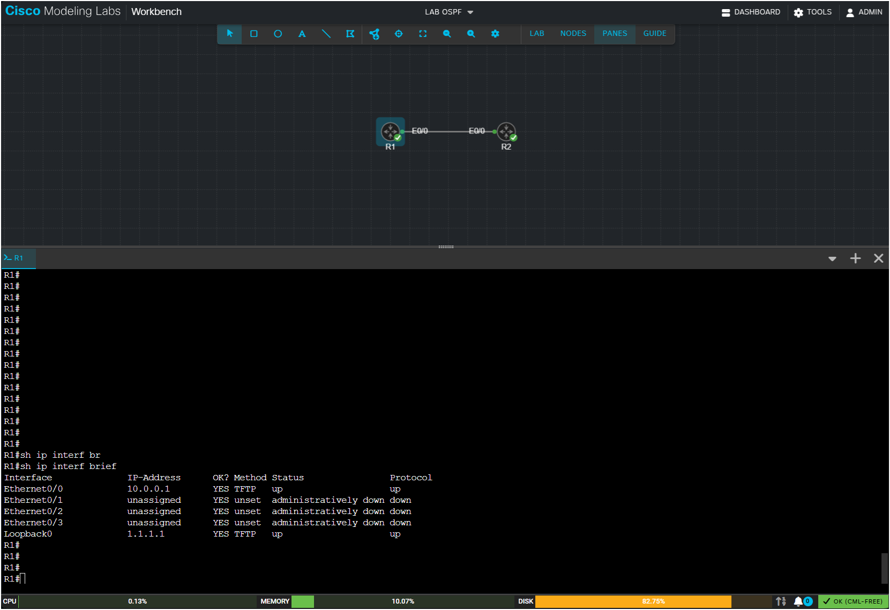
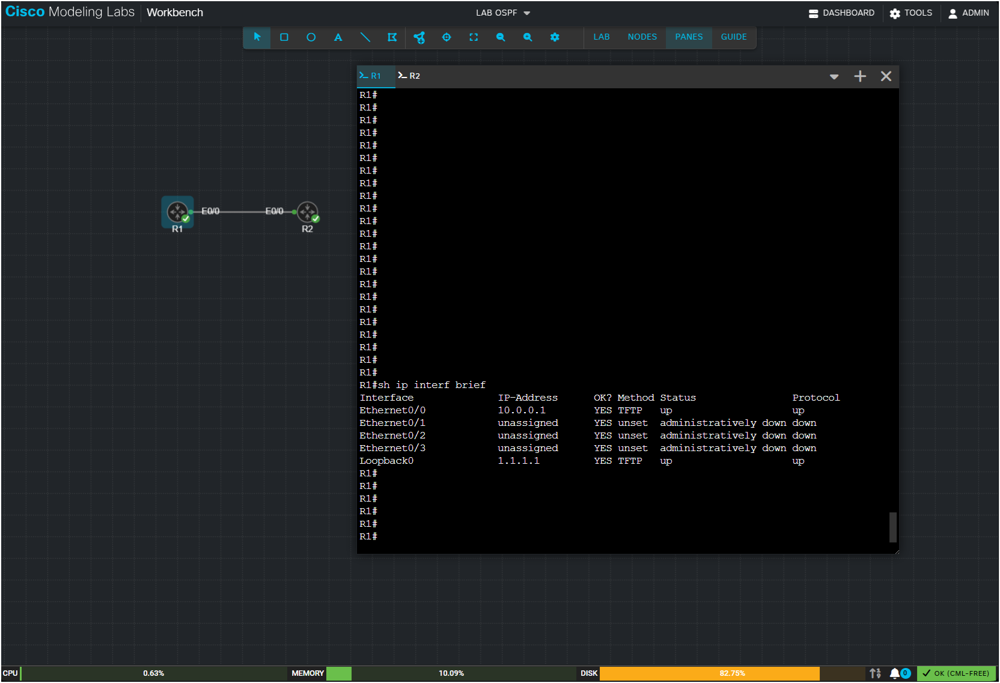

# CML Floating Console Panel

A browser bookmarklet that turns the console panel in Cisco Modeling Labs (CML 2.10) into a floating, draggable, resizable window instead of the fixed panel docked at the bottom of the screen.

The script runs entirely client side. It does not modify CML's server, backend, or any files on disk. Reloading the page or switching labs resets everything to default.

## Features

- Detaches the console panel from the page layout and displays it as a floating window, positioned in the upper right area of the screen.
- The panel can be dragged by its tab bar and resized from the corner.
- Works as a toggle: the first click on the bookmark activates the floating panel, the second click deactivates it and restores the original layout exactly, including panel size, canvas size, splitter visibility, and cursor style.

## Files

- [`bookmarklet.js`](bookmarklet.js): commented, readable source of the script. The content of this file is the same as in [`bookmarklet-url.txt`](bookmarklet-url.txt)
- [`bookmarklet-url.txt`](bookmarklet-url.txt): the minified one liner used as the bookmark URL.
- [`images/`](images): Folder that contains screenshots referenced in this README file.
- `README.md`

## Screenshots

| Original layout | Modified layout |
|:---:|:---:|
|  |  |

## Installation and Usage

1. Enable the bookmarks bar in Chrome (or any Chromium-based browser) with Ctrl+Shift+B.
2. Right-click the bookmarks bar and select Add page / Add site.
3. Enter any name you want for the bookmark (for example, CML Floating Panel).
4. Open [`bookmarklet-url.txt`](bookmarklet-url.txt), copy the entire single-line contents, and paste it into the bookmark's URL/Address field. Save the bookmark.
5. Open a lab in CML and open a console for any running node as usual (right-click the node and select Console).
6. Click the bookmark you created to activate floating mode: The console panel will detach from the bottom of the page and appear as a floating, draggable, and resizable window.

### Optional steps
7. Drag the panel by its tab bar and resize it from the corner as needed. You can also toggle PANES (in CML) to adjust the console layout.
8. To make room for the floating console and arrange the topology to your liking, hold Shift while selecting devices in the topology. You can then move the selected devices together and adjust the topology layout so that the devices and the floating console are positioned conveniently on screen.
9. Click the bookmark again to deactivate floating mode. The original CML layout will be restored, including the panel size, canvas size, splitter visibility, and cursor style.

Note: Reloading the page or switching labs automatically resets the state to the default CML layout.

## Configuration

The following values can be adjusted directly in the [`bookmarklet-url.txt`](bookmarklet-url.txt):

| Setting | Variable | Default |
|---|---|---|
| Distance from the top toolbar | `top` | 130px |
| Panel width (fraction of window width) | `vw * 0.48` | 48% |
| Panel height (fraction of window height) | `vh * 0.72` | 72% |
| Distance from the right edge | offset in `left` calculation | 20px |

## Tested On

Environment:
- CML: 2.10.0+build.13

Web browsers:
- Opera One: 134.0.5954.56 (Chromium 150.0.7871.224), Windows 11 64-bit
- Google Chrome: 151.0.7922.138 (Official Build), 64-bit

## Licensing and Legal Notes

This project is licensed under the MIT License. See [LICENSE](LICENSE) for details.

> **Disclaimer:** This is a browser-side UI customization for CML and is provided for informational and personal use. It is not legal advice.

This project is a client-side browser bookmarklet that changes how the CML console panel is displayed in the browser. It does not modify the CML server, backend, installation files, or any Cisco software on disk.

The bookmarklet operates on the DOM and CSS of the CML web interface after the user has authenticated normally. All changes are temporary and local to the current browser session; reloading the page or switching labs restores the default CML layout.

Users are responsible for ensuring that their use of the bookmarklet complies with the licenses, terms, and policies applicable to their CML installation and environment.

Cisco Modeling Labs and CML are trademarks of Cisco Systems, Inc. This project is an independent browser customization and is not affiliated with, sponsored by, or endorsed by Cisco.